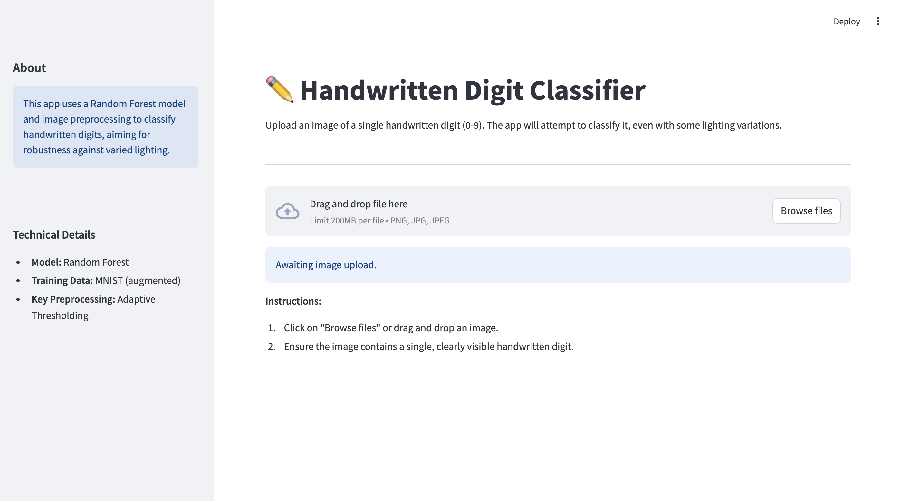

# ✏️ Handwritten Digit Classifier (Lighting Robust)

Check out the app here: [https://rf-digit-recognition-lighting.streamlit.app]()

## Objective

This project aims to develop a system that accurately classifies uploaded images of single handwritten digits (0-9). A key focus is to achieve robustness against common variations in lighting conditions using a Random Forest model coupled with advanced image preprocessing techniques. The application is deployed as an using Streamlit.

## Features

* **Single Digit Classification:** Predicts the digit (0-9) from an uploaded image.
* **Lighting Robustness:** Employs image preprocessing, primarily adaptive thresholding, to handle variations in input image lighting.
* **Streamlit App:** Provides a user-friendly interface built with Streamlit for image uploads and viewing results.
* **Processed Image Display:** Shows the user both their uploaded image and the binarized version that is fed to the model, offering transparency into the preprocessing step.
* **Confidence Score:** Displays the model's confidence in its prediction.

A detailed list of Python package dependencies can be found in `requirements.txt`.

## Methodology

### 1. Dataset
The core dataset used for training is the **MNIST dataset** of handwritten digits (28x28 pixels).

### 2. Data Augmentation for Training
To improve robustness to lighting and contrast variations, the MNIST training images were augmented by:
* Simulating random brightness adjustments.
* Simulating random contrast adjustments.

### 3. Image Preprocessing (Key to Lighting Robustness)
Both the augmented training images and user-uploaded images in the Streamlit app undergo the following preprocessing steps (defined in `image_preprocessor.py`):
1.  **Grayscaling:** Convert the image to grayscale.
2.  **Resizing:** Resize the image to 28x28 pixels.
3.  **Adaptive Thresholding (`cv2.adaptiveThreshold`):** This is the primary technique to handle varying illumination. It binarizes the image by calculating local thresholds, making it effective in separating the digit from the background even with uneven lighting. The output is typically a white digit on a black background.
4.  **Normalization:** Pixel values of the binary image are scaled to 0.0 (background) and 1.0 (foreground).
5.  **Flattening:** The 28x28 processed image is flattened into a 784-element feature vector.

### 4. Model
A **Random Forest Classifier** from Scikit-learn is used for digit classification. The model was trained on the flattened feature vectors obtained from the augmented and preprocessed MNIST data.

## Performance
* On the standard (preprocessed but not lighting-augmented) MNIST test set, the trained Random Forest model achieved an **accuracy of approximately 95.9%**.

## Screenshot

